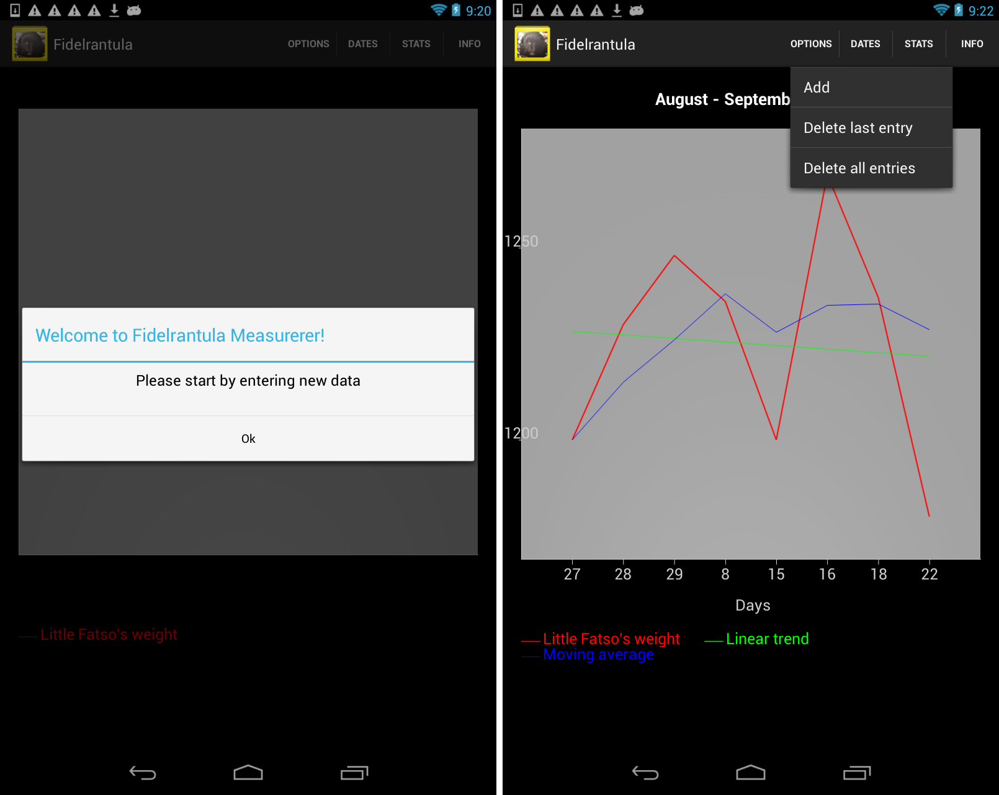

This is my personal project aimed at recording the weight of my one super guinea pig, Fidel.

The app was developed for Android and it allows to record your pet's weight in grams. The options include showing the running average
and a linear trend of the weight over time. Additional options include showing the weight over the last month, over the entire history or using a custom time range. You can also delete the last entry in case of a mistake.

The app uses the following libraries: [AChartEngine](https://code.google.com/p/achartengine/) and [ActionBarSherlock](http://actionbarsherlock.com/).

The app is not in Google Play but the sample images are available here:

